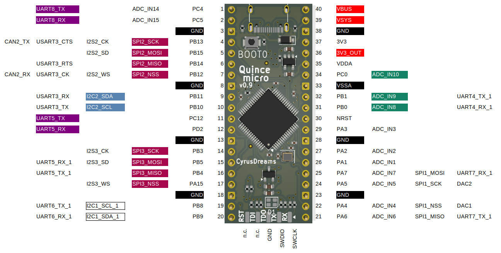
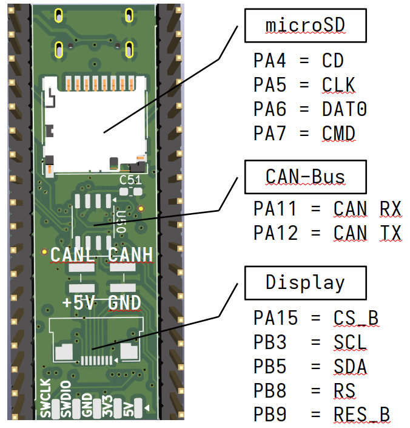
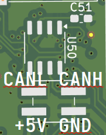

# Introduction

The 10-cent-microcontroller, it was everywhere in the news. With a 32bit RISC-V core and useful peripherals, the CH32V003 from WCH is suited to many projects. But such a small microcontroller needs to be programmed via a dedicated adapter. In a forum at mikrocontroller.net, user F.P. analyzed the WCH LinkE debugging adapter and came to the conclusion that the binary code from WCH can be run on the USB enabled CH32V305 microcontroller. And because the CH32V305 can do so much more than its smaller sibling, the idea of this development board was born.

This description is valid for the 'lite' variant of said development board and its second production release version '1.0'.

# Features of the Quince micro lite

-   board dimensions of 21 mm \* 51 mm are the same as a *RaspberryPi Pico*, but it lacks the mounting holes, due to the use of an USB-C connector

-   the pinout of the board is designed to match the peripherals on the *ClockworkPi Pico Calc* mainboard

-   the boards has mounting pads for a microSD card slot and a connector for an OLED screen, if those are mounted, the board has the same features as a *Longan Nano*

-   the *LinkE* debug connector is found on the PCB edge, the "lite" version omits the switchable target supply voltages

-   on the bottom side of the PCB, a CAN bus transceiver can be mounted, this makes the Quince micro a small CAN bus node

-   a RGB LED can be controlled from the microcontroller, two of the LEDs share the port with the Rx/Tx lines of the debug interface

## Pinout of the Quince micro

The coloured signals match the ones on a *Raspberry Pi Pico*.

Remark: ports PB8 and PB9 are exchanged in the v0.9 revision of the *Quince micro lite*.

## Quince micro compared to the Longan nano

On the bottom side of the *Quince micro*, additional parts can be assembled to have a similar functionality as a *Longan nano* development board:

-   microSD slot, the port pins are also available on pins 21, 22, 24 and 25 of the *Quince micro*

-   eight-pin connector for OLED displays

## Quince micro as a CAN bus node

On the bottom side of the PCB, a CAN bus transceiver can be mounted (position U50) with its decoupling capacitor (C51, 100nF) and a four pole SMD pin header. With the available signals CAN-high, CAN-low, 5V-supply and Ground, the Quince micro can be supplied with power and act as a CAN bus node.

Recommended are CAN-SIC transceivers (Signal Improvement Capability), if the additional cost of approximately 0.15€ is bearable for the intended project. These newer transceivers enable higher data rates and/or longer wiring distances than older CAN-FD transceivers. For *Quince micro*, CAN transceivers with 'standby' input and separate IO voltage are suitable. Examples of compatible transceivers are TJA1462 , TCAN1462, TLE9371VSJ and others.

# Quince micro is a Debugger

## Features of the Quince micro as a WCH LinkE Debugger

On the short side of the PCB, opposite of the USB-S connector, there are solder pads suitable for two sets of five pin headers. The pinout is close to the *WCH LinkE R0 1v3*; the power supply pins are not switchable. Also not available is the "ModeSelect" button. Its functionality can be controlled via software, as stated in the "WCH-LinkUserManual" (version V2.4).

## Setup of the Quince micro as a LinkE Debugger

In the forum of mikrocontroller.net, user [Benutzer F.P. (fail)](https://www.mikrocontroller.net/user/show/fail) posted the following [Instructions](https://www.mikrocontroller.net/topic/578672#7974902) that are similar for the *Quince micro*:

1.  Install the software from WCH, commands for Linux:

    1.  git clone https://github.com/ch32-rs/wchisp

    2.  git clone https://github.com/ch32-rs/wlink

2.  Build the software (see respective documentation)

3.  Put the microcontroller into the USB programming mode

    1.  unpower the Quince micro

    2.  push and hold BOOT0 switch

    3.  connect USB to a PC

    4.  release BOOT0 switch

4.  Flash the firmware from MounRiverStudio (see [mikrocontroller.net)](https://www.mikrocontroller.net/attachment/672558/WCH-LinkE-APP-IAP.bin)

    1.  wchisp flash WCH-LinkE-APP-IAP.bin

5.  restart the Quince micro: unplug USB, reconnect USB

Now the Quince micro is ready to function as a WCH-LinkE adapter. After connecting it to another CH32 target (for example another Quince micro), the second microcontroller can be programmed with, for example:

1.  wlink flash blink.bin

The connection to a second Quince micro is done by connecting the pins SWDIO and SWCLK of both boards.

# Developing Software for the Quince micro

## MounRiver Studio

MounRiver Studio is the IDE preferred by WCH.

## Arduino

WCH has released their own Arduino core. With it, the CH32V305-Microcontroller of the Qince micro can be programmed with the Arduino IDE. The board itself is not available in the IDE, but the peripherals can be addressed as on the development board 'CH32V305RBT6'. The following pins (D\* and A\*) are available:

## PlatformIO

There is a GitHub repositry for [CH32V](https://github.com/Community-PIO-CH32V/platform-ch32v) in the PlatformIO IDE.

## cnlohr / ch32fun

Developer and YouTuber CNLohr (Charles) released his own development environment for CH32V with the name [ch32fun](https://github.com/cnlohr/ch32fun) on GitHub.

## Python

There is an [experimental port](https://github.com/r4d10n/micropython-wch-ch32v307/tree/master/ports/wch) of MicroPython for the CH32V307, this should also be useable for the CH32V305.

# Annex

## Revision History

### Revision v0.9

First production data.

### Revision v1.0

-   Changed the connection of PB8 and PB9 to match the RaspberryPi pinout, enabling an additional IC bus.

-   Connected 5V and 3.3V to the debug connector (non-switchable supply)

## Copyright

This text is licensed by CC-BY-SA-4.0. Product names and other trademarks are in the possession of their respective owners. This text makes no claim regarding those names but needs to use them for documentation and clarification purposes.

The Quince micro lite board itself is licensed via CERN-OHL-S-2.0, modifications and improvements are welcome.
